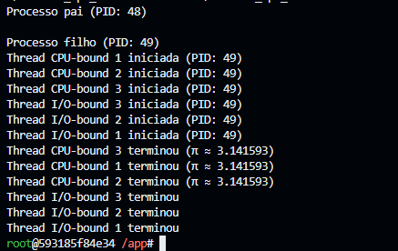

Nome: Gustavo Maia Militão
Data: 27/09/2006

1. Objetivo
Com base em escalonamento de tarefas, o objetivo dessa atividade é, além de executar um código que contém dois tipos de threads, é fazer a análise de desempenho de ambos.

2. Passos Executados

    2.1 Modificações no programa\
    Foram feitas as seguintes modificações no código original:

    - **Adicionada uma nova thread CPU-bound**, totalizando 3 threads CPU-bound.
    - **Adicionada uma nova thread I/O-bound**, totalizando 3 threads I/O-bound.
    - **Alterado o cálculo realizado nas threads CPU-bound**:

        ```c
        for (long i = 0; i < n; i++) {
            pi += (i % 2 == 0 ? 1.0 : -1.0) / (2 * i + 1);
        }
        pi *= 4;
        ```
    
    Resultados:\
    

    2.2 Executando comando\
    Devido a permissão, não foi possível executar o comando:
    

    2.3 Diferenças observadas\
    As threads I/O-bound apenas simulam espera utilizando sleep, praticamente não exigindo processamento e apenas gerando pequenas mudanças de contexto. Em resumo, mesmo sem dados exatos do monitoramento da CPU-bound pode-se ver que as I/O-bound refletem cenários típicos de entrada/saída, aproveitando a concorrência sem sobrecarregar o processador.